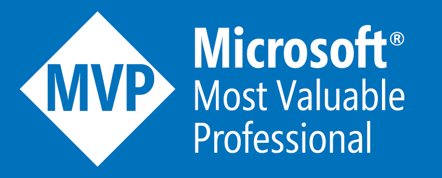

## Hi there 👋

My name is **Temani Afif** 

I am a CSS Hacker, a computer engineer, an expert web developer, a content creator and more!

-----

🧠 The mastermind behind [CSS Challenges](https://css-challenges.com/)

👨‍💻 An active contributor at [Stack Overflow](https://stackoverflow.com/users/8620333/temani-afif)

📝 Author at [CSS Tricks](https://css-tricks.com/author/afiftemani/) and [DEV](https://dev.to/afif)

🔧 I make cool stuff on [Codepen](https://codepen.io/t_afif)

✨ I share Web tricks on [Twitter](https://twitter.com/ChallengesCss)

🥇 I am a [W3Schools certified](https://certification.w3schools.com/w3certified.asp?id=7368672)

🏆 I am a [Microsoft MVP](https://mvp.microsoft.com/fr-fr/PublicProfile/5004281?fullName=Temani%20Afif)

